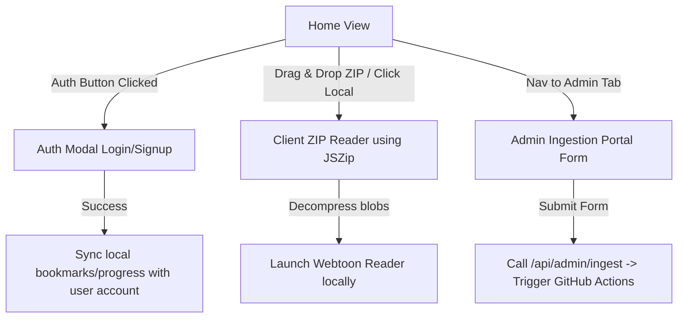

# Implementation Plan: Admin Portal, Supabase Auth, & Local ZIP Reader

This plan outlines the combined implementation of the Admin Ingestion UI, the Supabase authentication flow, and the offline local ZIP/CBZ reader widget.

---

## 🏗️ Combined Architecture & Flow

---

## 📂 New Component Features

### 1. Admin Portal UI (แท็บแผงควบคุมแอดมิน)
- Accessible via a new nav tab `"admin"`.
- Form Fields:
  - Manga ID (e.g. `webtoon-character-kang-lim`)
  - Chapter ID (e.g. `kanglim-ch173`)
  - Chapter Title (e.g. `ตอนที่ 173`)
  - ZIP Download URL (Direct link to raw ZIP)
- Action: Sends POST request to `/api/admin/ingest` and displays logs/status.

### 2. Supabase Auth Integration (ระบบสมัครสมาชิก/เข้าสู่ระบบ)
- A sleek modal for signing up and logging in using standard email and password.
- Triggers on clicking a new "Login" button in the navbar.
- Stores session tokens and links client-side reads to the user's UUID in the Supabase database.
- Auto-syncs any bookmarks created locally *before* login to the user's account upon successful sign-in!

### 3. Local ZIP/CBZ Reader (ระบบอ่านไฟล์เครื่องตนเอง)
- Drag-and-drop listener on the home page. Shows a dashed-border drop overlay when files are dragged over.
- Instantly decompresses `.zip` / `.cbz` files in the browser using `JSZip`, naturally sorts image filenames, and creates Blob URLs.
- Launches the reader locally, revoking URLs on exit to prevent memory leaks.
- A card widget "เปิดอ่านไฟล์ ZIP/CBZ ในเครื่อง" is placed right under the banner.
