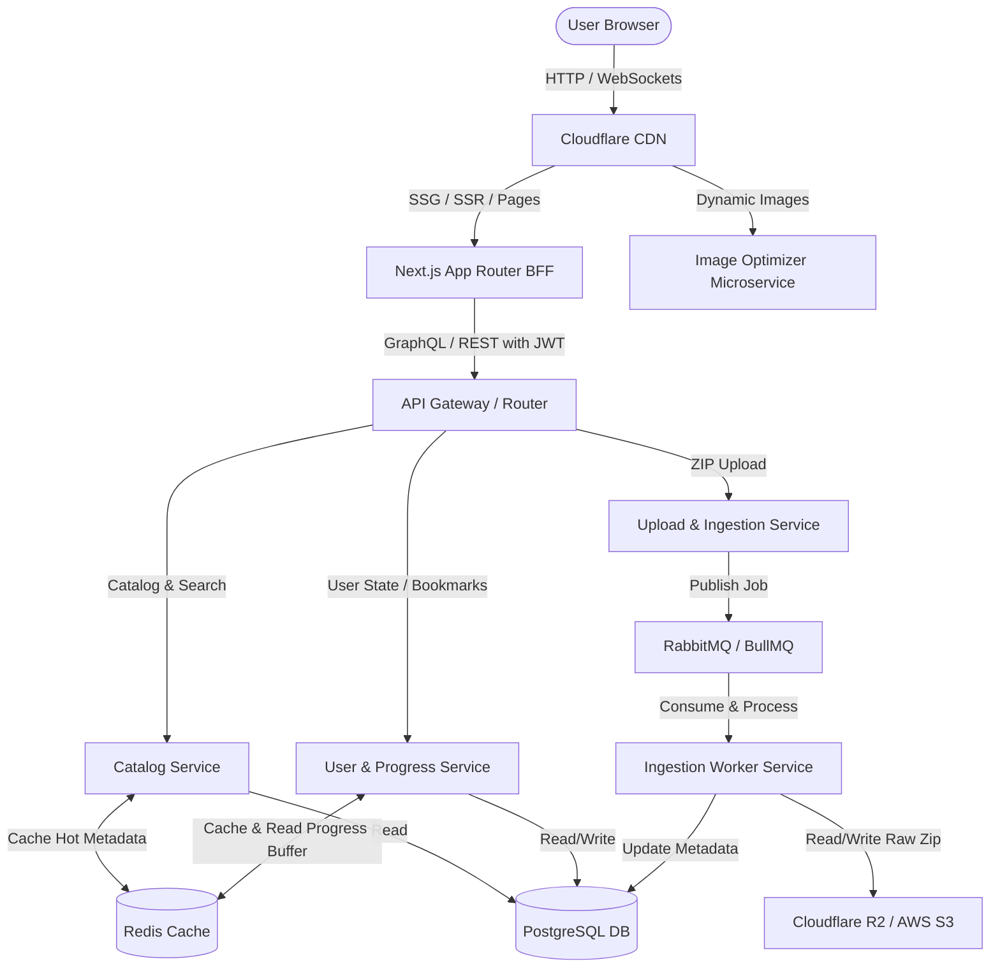
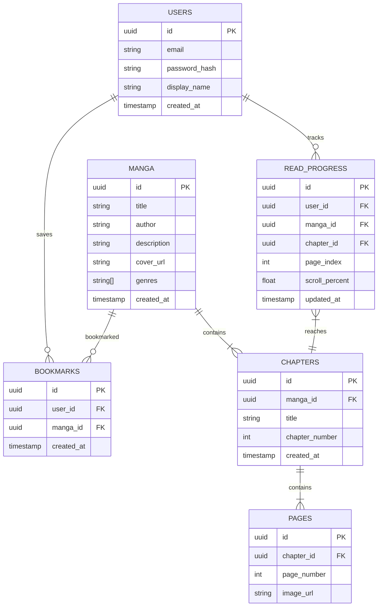

# Full-Stack System Architecture: Mangify

This document details the production-ready full-stack architecture for **Mangify**, designed for high scalability, near-instant image loading, and low-latency progress syncing.

---

## 🏗️ System Overview

---

## 🧩 Component Breakdown

### 1. Next.js App Router (BFF - Backend for Frontend)
- **Role**: Serves the React frontend using Server Components (RSC) for optimized SEO, initial load speed, and core layouts.
- **Authentication**: Integrates **NextAuth.js (Auth.js)** to handle OAuth (Google, Discord) and credentials. It issues an encrypted HTTP-only cookie.
- **API Proxying**: Proxies client requests to the backend microservices, attaching a signed JWT token in the `Authorization` header.

### 2. Backend Microservices
- **Catalog Service (Go / Node.js)**
  - Manages manga metadata, categories, authors, and chapter indexes.
  - Queries **PostgreSQL** and caches results in **Redis** (manga metadata is heavily read but rarely changed).
- **User & Progress Service (Go / Node.js)**
  - Manages reading history, bookmarks, ratings, and active reading positions.
  - Receives real-time progress updates. Saves updates to **Redis** first, then flushes them to **PostgreSQL** in batches every 30 seconds to prevent DB write congestion.
- **Image Optimizer Service (Go / Rust)**
  - Optimizes raw manga pages on-the-fly. Converts pages to `WebP` or `AVIF` based on user-agent capabilities and resizes images to fit the reader's viewport size.
  - Returns optimized images with aggressive Cache-Control headers, allowing **Cloudflare CDN** to cache them at the edge.
- **Upload & Ingestion Service (Node.js / Go)**
  - Handles administrative uploads of `.zip` or `.cbz` manga files.
  - Uploads the raw ZIP file directly to secure storage (Cloudflare R2/S3) and queues an ingestion task in **RabbitMQ/BullMQ**.

### 3. Ingestion Worker (Background Service)
- Consumes tasks from the Queue.
- Downloads the raw ZIP, extracts images, runs optimization checks (ensures correct ordering and strips metadata), uploads individual optimized pages to S3/R2, and inserts page URLs and chapter details into **PostgreSQL**.

---

## 🗄️ Database Schema Design (PostgreSQL)

### Key Indexes for Performance:
- `idx_read_progress_user_manga`: Composite index on `(user_id, manga_id)` for quick retrieval of reading history when loading a manga detail page.
- `idx_pages_chapter_order`: Composite index on `(chapter_id, page_number)` for sorting pages instantly when launching the reader.

---

## 🔑 Authentication Flow (JWT)

1. **User logs in** via Next.js `/api/auth`. NextAuth.js validates credentials and stores user details.
2. Next.js signs a stateless **JWT** (signed using a private key/JWKS) containing `userId`, `email`, and `roles`.
3. When the user loads a page, the client browser talks to Next.js. For backend-specific operations, Next.js calls the microservices, appending the JWT inside the `Authorization: Bearer <token>` header.
4. Microservices verify the signature using the public key (JWKS) or shared secret. No database lookup is needed for auth verification.

---

## 🛠️ Recommended Tech Stack & Tools

| Component | Technology | Rationale |
| :--- | :--- | :--- |
| **Frontend Framework** | **Next.js 14+ (App Router)** | Excellent SEO via Server-Side Rendering (SSR), built-in API proxying, and Auth.js integration. |
| **Relational Database** | **PostgreSQL (Supabase / Neon)** | Excellent support for JSONB (tags/genres), relational indexing, and ACID compliance. |
| **Caching & Queue Buffer**| **Redis** | Sub-millisecond latency for progress buffering and hot manga metadata caching. |
| **Object Storage** | **Cloudflare R2** | Zero egress fees for downloading manga images, significantly lowering operational costs. |
| **Job Queue** | **RabbitMQ (Go/Rust) / BullMQ (Node)**| Robust event handling for background tasks like ZIP extracting and resizing. |
| **ORM / Migration** | **Prisma / Drizzle ORM** | Clean schema migrations and type safety. Drizzle is preferred for microservices due to its low performance overhead. |
| **Deployment & Containers**| **Docker + Docker Compose** | Simple containerization of services. Easily scales into Kubernetes or AWS ECS. |
