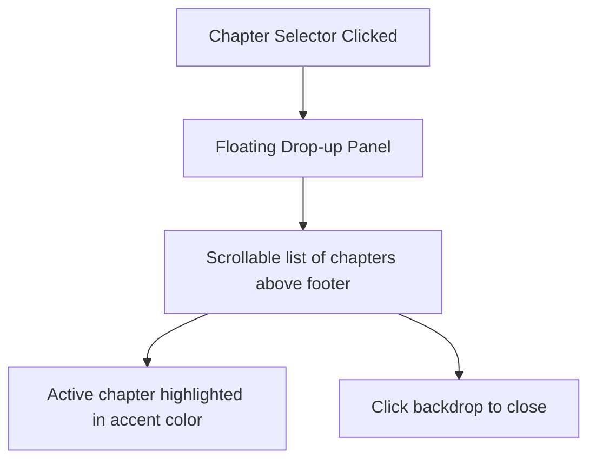

# Premium Custom Chapter Selector: UI/UX Redesign

The native `<select>` dropdown has been replaced with a custom React control group in [src/app/page.tsx](file:///C:/Base/20-29_Work_and_Projects/21_Active_Projects/Mangify/src/app/page.tsx). This fixes browser styling limits and delivers a thumb-friendly mobile interface.

---

## 📐 Layout & Interaction Flow

### 1. The Trigger Control Group
Instead of a single drop-down menu, we group three buttons inside a unified styled pill container (`bg-surface border border-border rounded-full p-1`):
- **Prev Chapter Button (`ChevronLeft`)**: Shorter shortcut path. Disabled on the first chapter.
- **Current Chapter Name**: A pill button showing `ตอนที่ X` with a custom chevron state indicator.
- **Next Chapter Button (`ChevronRight`)**: Shorter shortcut path. Disabled on the final chapter.

### 2. Drop-up Popover Panel
Renders `absolute bottom-[48px] right-0 sm:right-1/2 sm:translate-x-1/2 w-64 max-h-72 overflow-y-auto bg-surface border border-border rounded-2xl shadow-xl p-1.5 backdrop-blur-md z-[1025] animate-in fade-in slide-in-from-bottom-2 duration-200`:
- **Active Chapter Highlight**: The active chapter has a special styling class (`bg-accent/10 text-accent font-semibold`) and a dot indicator.
- **Scrollbar**: Clean `scrollbar-thin` layout.
- **Outside Click Dismissal**: A transparent fixed overlay backdrop (`fixed inset-0 z-[1015] bg-transparent`) automatically closes the dropdown when a user clicks anywhere else.
