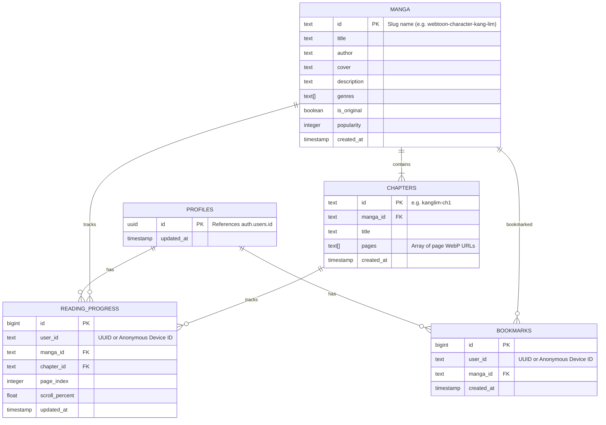

# Supabase Database Implementation Plan

This plan details the database schema (PostgreSQL) and the Next.js API endpoints (BFF) to handle bookmarks and reading progress syncing using a hybrid anonymous/authenticated architecture.

---

## 🏗️ PostgreSQL Database Schema



### 1. Table: `manga`
Catalog metadata for manga titles.
- `id` (Text, Primary Key)
- `title` (Text)
- `author` (Text)
- `cover` (Text)
- `description` (Text)
- `genres` (Text[] array)
- `is_original` (Boolean)
- `popularity` (Integer)
- `created_at` (Timestamp)

### 2. Table: `chapters`
List of pages grouped by chapter.
- `id` (Text, Primary Key)
- `manga_id` (Text, Foreign Key references `manga.id`)
- `title` (Text)
- `pages` (Text[] array of absolute WebP URLs)
- `created_at` (Timestamp)

### 3. Table: `profiles`
Holds authenticated user metadata. Linked 1:1 with Supabase Auth.
- `id` (UUID, Primary Key, references `auth.users`)
- `updated_at` (Timestamp with timezone)

### 4. Table: `bookmarks`
Track manga bookmarks for both registered users (UUID) and anonymous users (Device ID).
- `id` (BigInt, Identity, Primary Key)
- `user_id` (Text, Indexed) - Can be UUID or LocalStorage Device UUID.
- `manga_id` (Text, Foreign Key references `manga.id`)
- `created_at` (Timestamp with timezone)

### 5. Table: `reading_progress`
Track scroll percent and active pages.
- `id` (BigInt, Identity, Primary Key)
- `user_id` (Text, Indexed)
- `manga_id` (Text, Foreign Key references `manga.id`)
- `chapter_id` (Text, Foreign Key references `chapters.id`)
- `page_index` (Integer)
- `scroll_percent` (Float/Numeric)
- `updated_at` (Timestamp with timezone)

---

## 📡 API Endpoints (BFF)

We will implement Next.js API Routes in `src/app/api/` to handle operations:

### 1. `/api/sync/progress` (`POST`)
Receives throttled client updates. Performs an `upsert` matching `(user_id, manga_id)` to update chapter, page, and scroll progress.
```json
{
  "userId": "anon-device-uuid-1234",
  "mangaId": "webtoon-character-kang-lim",
  "chapterId": "kanglim-ch15",
  "pageIndex": 0,
  "scrollPercent": 45.2
}
```

### 2. `/api/sync/bookmarks` (`GET`, `POST`, `DELETE`)
Manages user bookmarks.
- `GET`: Retrieve all bookmarks for a specific `userId`.
- `POST`: Add a bookmark.
- `DELETE`: Remove a bookmark.

---

## 🛠️ Implementation Steps

1. **Install Supabase Client SDK**: `npm install @supabase/supabase-js`.
2. **Database SQL Script**: Create `supabase/schema.sql` with tables, indices, triggers, and Row Level Security (RLS) policies.
3. **BFF Clients Setup**: Create `src/lib/supabaseClient.ts` using standard `process.env.NEXT_PUBLIC_SUPABASE_URL` and `process.env.NEXT_PUBLIC_SUPABASE_ANON_KEY`.
4. **API Routes**: Write App Router Route Handlers.
5. **Frontend Client Integration**: Attach the throttled sync routine to the manga reader window.
