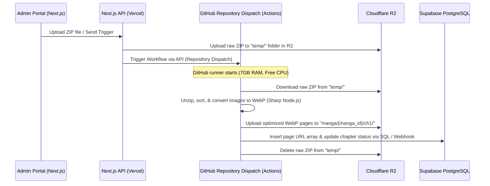

# 100% Free-Tier Architecture: Mangify

This updated architecture specifies services and setups that are **completely free** (no cost/no credit card required, or highly generous free tiers) for host deployment, image hosting, database management, and asynchronous background tasks.

---

## 🏗️ Free-Tier Cloud Service Map

| Role | Provider / Service | Free-Tier Limits | Setup Details |
| :--- | :--- | :--- | :--- |
| **Frontend & BFF** | **Vercel** | 100 GB Bandwidth/mo, Free SSL, Serverless Functions | Hosts Next.js App Router & Auth.js API handlers. |
| **Database** | **Supabase** or **Neon.tech** | 500 MB Database storage, 1 GB file storage, unlimited API requests | Relational DB for Users, Manga metadata, Bookmarks, and Chapters. |
| **Manga Object Storage** | **Cloudflare R2** | **10 GB Storage**, 1M Class A operations/mo, 10M Class B operations/mo, **$0 Egress Fees** | Stores optimized WebP/AVIF manga images. R2 does not charge for egress (bandwidth), making it ideal for free image hosting. |
| **Caching & Queue** | **Upstash Redis** | **10,000 Commands/day** (Serverless) | Fast session caching and scrolling progress buffers. |
| **Asynchronous Worker** | **GitHub Actions** | **2,000 free runner minutes/month** (Private repo) or **Unlimited** (Public repo) | A custom workflow runner that processes, unpacks, and optimizes ZIP files, then uploads pages to R2 and writes links to the DB. |

---

## 🔄 Free-Tier Ingestion Workflow (The GitHub Actions Hack)

Since free servers (like Render or Koyeb Free) have RAM limits (512MB) and timeout thresholds, they will crash when trying to extract and optimize large manga ZIP files (e.g. 50MB-100MB). 

By leveraging **GitHub Actions**, we get a high-power VM (2-core CPU, 7GB RAM) completely for free to process the ZIP.

---

## 💸 Cost Mitigation Features in Code

1. **Lazy Loading and Client-Side Decompression**:
   - Enable local ZIP files to be processed client-side (using JSZip) so users who read their own files consume **$0 server resources**.
2. **On-the-fly Image Resizing (Cloudflare CDN / Free Resizing)**:
   - Use Cloudflare's free cache edge to store image files.
3. **Write-Buffering in Upstash**:
   - Reading progress is updated frequently. Directly hitting Supabase PostgreSQL on every scroll event will exhaust the database connection limits.
   - The Next.js BFF logs scrolling events to **Upstash Redis** (cheap, fast commands).
   - A single scheduled Vercel Cron Job runs once every few minutes, fetches the buffered progress from Redis, and performs a single bulk `INSERT ... ON CONFLICT` into Supabase.
