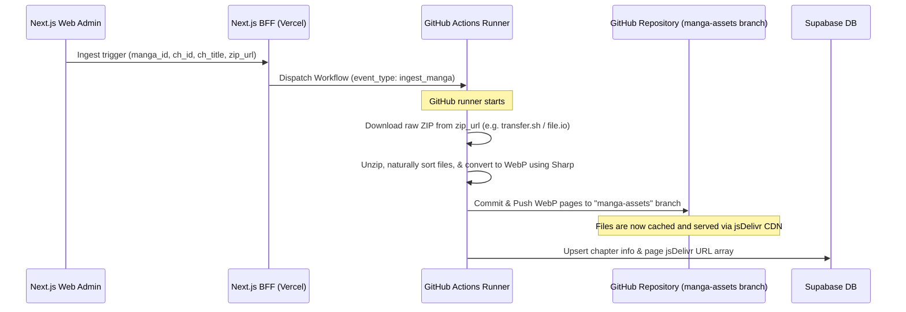

# 100% Free-Tier Architecture: Mangify (GitHub + CDN Edition)

This updated architecture specifies services and setups that are **100% free** (no credit card required, zero costs) for host deployment, image hosting, database management, and asynchronous background tasks.

---

## 🏗️ Free-Tier Cloud Service Map

| Role | Provider / Service | Free-Tier Limits | Setup Details |
| :--- | :--- | :--- | :--- |
| **Frontend & BFF** | **Vercel** | 100 GB Bandwidth/mo, Free SSL, Serverless Functions | Hosts Next.js App Router & Auth.js API handlers. |
| **Database** | **Supabase** | 500 MB Database storage, 10,000 active users | Relational DB for Users, Bookmarks, Reading Progress, Manga Catalog, and Chapters. |
| **Manga Object Storage** | **GitHub Repository (`manga-assets` branch)** | **10 GB Storage limit** | Stored directly in the GitHub repository on a dedicated assets branch. |
| **Manga CDN Delivery** | **jsDelivr CDN** | **Unlimited bandwidth**, global edge caching | Renders pages via jsDelivr CDN (`https://cdn.jsdelivr.net/gh/...`) for instant loading. |
| **Asynchronous Worker** | **GitHub Actions** | **2,000 free runner minutes/month** | A custom workflow runner that downloads ZIP files (from temp links) or scrapes URLs, unzips, optimizes to WebP, commits to the assets branch, and updates Supabase. |

---

## 🔄 Free-Tier Ingestion Workflow (The GitHub + CDN Hack)

---

## 💸 Cost Mitigation Features in Code

1. **Zero Egress/Storage Fees**:
   - By using GitHub for storage and jsDelivr for CDN delivery, we get high-speed global image delivery without paying for Cloudflare R2 or AWS egress.
2. **Serverless Triggering**:
   - The Next.js BFF does not handle file processing or large uploads, staying safely within Vercel's free serverless limits.
3. **Throttled DB Sync**:
   - Reading progress is throttled to once every 10 seconds of active reading and written directly to Supabase to prevent connection limit exhaustion.
