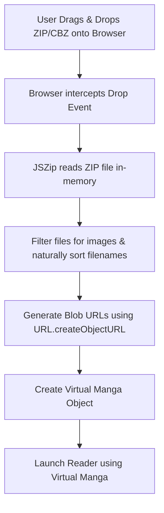

# Local ZIP/CBZ Reader Implementation Plan

This plan details the integration of client-side `.zip` and `.cbz` parsing in Mangify, enabling users to read their own local files instantly without uploading them to any server ($0 server resource cost).

---

## 🔄 Interaction Flow



---

## 🛠️ Key Implementation Details

### 1. File Upload / Drop Area
- A clean, dash-bordered overlay is shown when a file is dragged over the catalog screen.
- Supports both drag-and-drop and standard file input selection.

### 2. Natural Sorting
- Extracted image paths must be sorted using alphanumeric natural sort (e.g. `page-2.png` before `page-10.png`) to preserve reading order:
  ```javascript
  const collator = new Intl.Collator(undefined, { numeric: true, sensitivity: 'base' });
  imageFiles.sort((a, b) => collator.compare(a.name, b.name));
  ```

### 3. Blob URL Management
- Read each sorted file as a `blob` and generate a temporary local URL using `URL.createObjectURL()`.
- To prevent memory leaks, these URLs should be revoked (`URL.revokeObjectURL()`) when the reader is closed or when a new manga is loaded.

### 4. Virtual Manga Creation
Create a mock `Manga` object structure to feed directly into the existing reader view:
```typescript
const virtualManga: Manga = {
  id: "local-manga-id",
  title: zipFilename.replace(/\.[^/.]+$/, ""), // strip extension
  author: "Local File",
  cover: firstPageBlobUrl || "/assets/placeholder-cover.jpg",
  description: "Parsed locally via browser",
  chapters: [
    {
      id: "local-ch-1",
      title: "ตอนที่ 1 (ไฟล์ในเครื่อง)",
      pages: pageBlobUrls // Array of Blob URLs
    }
  ]
};
```
