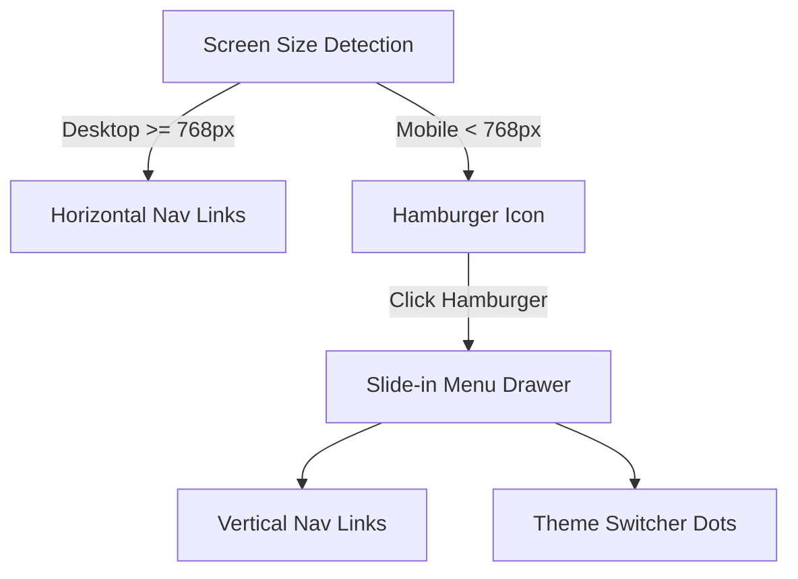

# Design & Implementation Plan: Webtoon-Style Navbar

This plan outlines the implementation of a Webtoon-style navigation bar for **Mangify**, featuring a responsive desktop/mobile layout and functional Single-Page Application (SPA) actions.

---

## 🧭 Navbar Elements & Action Mapping

To prevent "dead links" in our single-page application, we will wire the navbar items to control the library's active state:

1. **Logo (`Mangify`)**
   - **Action**: Resets all filters and shows the default homepage library.
2. **Originals (ออริจินัล)**
   - **Action**: Displays curated professional demo manga series.
3. **Genres (หมวดหมู่)**
   - **Action**: Toggles a sleek, minimalist tag container (Adventure, Slice of Life, Sci-Fi) to filter the grid.
4. **Ranking (อันดับ)**
   - **Action**: Sorts the manga grid (Popularity, Alphabetical, Release date).
5. **Canvas (ครีเอเตอร์)**
   - **Action**: Opens a clean drawer containing community uploaded works (or highlights indie titles).

---

## 📱 Responsive Layout & Mobile Hamburger

### Mobile Hamburger Design:
- **Trigger**: A double-line or three-line modern icon on the right side.
- **Drawer**: An overlay with `fixed top-0 right-0 h-full w-[280px] bg-background border-l border-border z-[999]`.
- **Transitions**: Smooth slide-in/out transition using Tailwind CSS:
  - Open: `translate-x-0`
  - Closed: `translate-x-full`
- **Backdrop**: A semi-transparent overlay (`fixed inset-0 bg-black/30 z-[998]`) that closes the menu when tapped.
