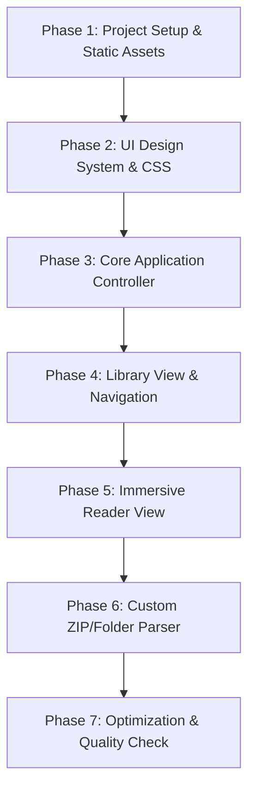

# Project Plan: Mangify - Minimalist Manga Web Reader

Mangify is an ultra-minimalist manga and webtoon reading web application. It combines the clean, immersive aesthetics of **Meb** with the fluid vertical scroll navigation of **Webtoon**, built using Next.js, TypeScript, and Tailwind CSS.

---

## 🎨 Key Features & UX Decisions

1. **Cover-Focused Library Grid**
   - Clean, borderless cover cards with smooth scaling animations on hover.
   - Text metadata fades in gently.
   - A floating "Quick Resume" banner allows users to resume their last read manga instantly.

2. **Ultra-Minimalist Reader View**
   - **Default State**: 100% full screen for the manga images. No navigation bars, no borders.
   - **Hover/Tap Trigger**: Click/tap anywhere (or hover near the top/bottom edges on desktop) to slide in the header (back button, title, progress bar) and footer (theme, reading mode toggle, chapter selector).

3. **Hybrid Reading Modes**
   - **Webtoon Mode**: Continuous vertical scroll with auto-loading next chapter at the bottom.
   - **Manga Mode**: Horizontal page-by-page swiping/clicking with double-page support.

4. **Multi-Theme Engine**
   - 4 HSL palettes: Light (Warm White), Sepia (Paper), Soft Charcoal (Dark), OLED Black.
   - Elegant typography with Playfair Display (Titles) and Inter (UI elements).

5. **Drag-and-Drop ZIP/Folder Reader**
   - Support for drag-and-dropping local `.zip` or `.cbz` comic files, or folders containing images, which parses and displays them in the reader using Client-Side JavaScript (JSZip).

---

## 📂 Project Structure

```
Mangify/
├── src/
│   ├── app/
│   │   ├── page.tsx          # Main catalog & reader client app
│   │   ├── globals.css       # Tailwind CSS v4 setup & theme variables
│   │   └── layout.tsx        # Next.js root layout
│   ├── data/
│   │   └── mangaData.ts      # Scraped manga chapters & URLs
│   ├── types/
│   │   └── index.ts          # Core type definitions
│   └── lib/                  # Utilities (e.g. Supabase, helpers)
└── package.json
```

---

## 🚀 Step-by-Step Implementation Strategy



### Phase 1: Project Setup & Static Assets
- Generate high-quality manga covers and sample panels using `generate_image`.
- Set up directories and structure.

### Phase 2: Design System (Vanilla CSS)
- Implement CSS variables for themes: Light, Sepia, Charcoal, OLED.
- Define layout grids, flex containers, typography presets, and animations.
- Focus on clean visual transitions (fade-in, slide-up).

### Phase 3: Core & State Management
- Manage state: `currentManga`, `currentChapter`, `currentPage`, `readProgress`, `readingMode` (vertical vs. horizontal), `theme`.
- Persistence using `localStorage` for reading history and active theme.

### Phase 4: Library View
- Render beautiful cover grids.
- Implement "Quick Resume" banner showing last read item.

### Phase 5: Reader View (Horizontal & Vertical)
- Implement seamless vertical scroll.
- Add tap/hover trigger overlay for controls.
- Implement page-by-page horizontal transition (with swipe gestures).

### Phase 6: ZIP & Folder Parser
- Integrated client-side `.zip` / `.cbz` parsing (loading images as Blob URLs).
- Enable dragging any comic ZIP directly onto the screen to launch the reader.
