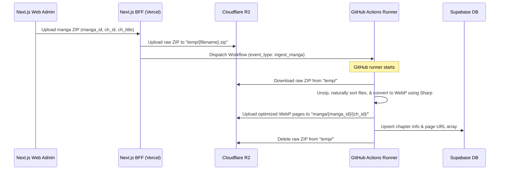

# Storage & Ingestion Implementation Plan

This plan details the implementation of the Cloudflare R2 object storage and the GitHub Actions automated manga ingestion worker.

---

## 🏗️ Ingestion Workflow

---

## 📂 New File Additions

1. **Next.js Upload & Dispatch Endpoint**:
   - `src/app/api/admin/upload/route.ts`
2. **GitHub Actions Workflow File**:
   - `.github/workflows/ingest.yml`
3. **Ingestion Node.js Script**:
   - `scripts/ingest.js`

---

## 🛠️ Required Environment Variables & Secrets

### Vercel / Next.js Environment Variables (for BFF):
- `R2_ACCESS_KEY_ID`: Cloudflare R2 Access Key ID.
- `R2_SECRET_ACCESS_KEY`: Cloudflare R2 Secret Access Key.
- `R2_BUCKET_NAME`: Cloudflare R2 Bucket Name.
- `R2_ENDPOINT`: Cloudflare R2 Endpoint URL (e.g. `https://<accountid>.r2.cloudflarestorage.com`).
- `R2_PUBLIC_URL`: Public access URL for files (e.g. custom domain or R2.dev domain).
- `GITHUB_PAT`: GitHub Personal Access Token (PAT) with repo scope to dispatch workflows.
- `GITHUB_REPO_OWNER`: The username/org owning the repo (e.g. `PhuriphatTyPeZ3r0`).
- `GITHUB_REPO_NAME`: The name of the repo (e.g. `Mangify`).

### GitHub Action Secrets (for runner):
- `R2_ACCESS_KEY_ID`
- `R2_SECRET_ACCESS_KEY`
- `R2_BUCKET_NAME`
- `R2_ENDPOINT`
- `NEXT_PUBLIC_SUPABASE_URL`
- `SUPABASE_SERVICE_ROLE_KEY`
