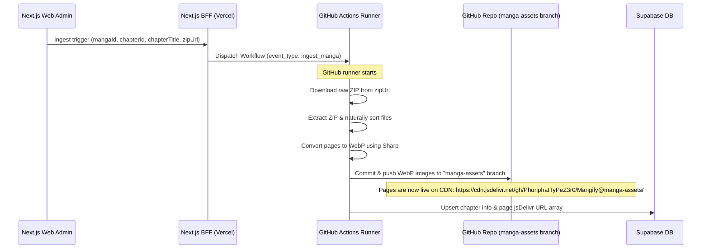

# Storage & Ingestion Plan: GitHub + CDN Edition

This plan details the implementation of storing manga images directly in a dedicated branch of the GitHub repository and serving them via the free, high-performance jsDelivr CDN.

---

## 🏗️ Ingestion Workflow

---

## 📂 File Changes

1. **Next.js Ingest API Endpoint**:
   - `src/app/api/admin/ingest/route.ts` (replaces `/api/admin/upload/route.ts`)
2. **GitHub Actions Workflow File**:
   - `.github/workflows/ingest.yml`
3. **Ingestion Node.js Script**:
   - `scripts/ingest.js`

---

## 🛠️ Required Environment Variables & Secrets

### Vercel / Next.js Environment Variables (for BFF):
- `GITHUB_PAT`: GitHub Personal Access Token (PAT) with repo scope to dispatch workflows.
- `GITHUB_REPO_OWNER`: `PhuriphatTyPeZ3r0`
- `GITHUB_REPO_NAME`: `Mangify`

### GitHub Action Secrets (for runner):
- `NEXT_PUBLIC_SUPABASE_URL`
- `SUPABASE_SERVICE_ROLE_KEY`
- `GITHUB_TOKEN` (provided automatically by GitHub Actions, but can use `GITHUB_PAT` for push rights if needed)
