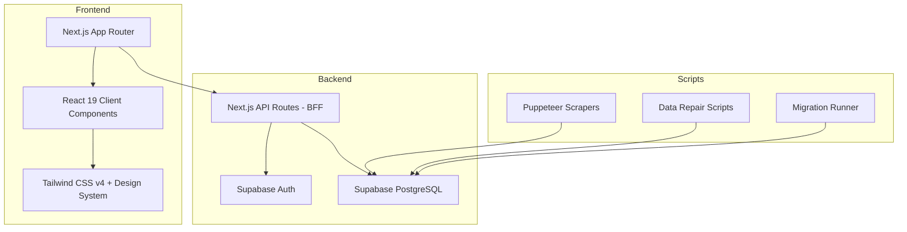

# 📖 Mangify — Project Overview

> **สถานะ:** Active Development (v0.1.0)
> **Tech Stack:** Next.js 16 (App Router) + TypeScript + Tailwind CSS v4 + Supabase (PostgreSQL + Auth)
> **Repo:** `C:\1_Projects\01_Active_Projects\Mangify`
> **Deployment:** Vercel
> **วันที่อัปเดต:** 2026-06-21

---

## 🎯 วัตถุประสงค์ (What is Mangify?)

Mangify เป็นเว็บแอปพลิเคชันสำหรับอ่านมังงะและเว็บตูน ออกแบบมาในแนว Ultra-Minimalist ที่ผสมผสาน:
- **ความสวยงามของ Meb** (Clean, cover-focused UI)
- **ประสบการณ์อ่านแบบ Webtoon** (Vertical continuous scroll)
- **ระบบธีมหลากหลาย** (Light, Sepia, Charcoal, OLED)
- **รองรับ ZIP/CBZ** สำหรับอ่านไฟล์ในเครื่อง (Client-side JSZip)

---

## 🏗️ Architecture Overview



---

## 📂 โครงสร้างโปรเจกต์หลัก

```
Mangify/
├── src/
│   ├── app/
│   │   ├── page.tsx          # Main SPA (66KB+) — Catalog, Reader, State
│   │   ├── globals.css       # Theme system & CSS variables
│   │   ├── layout.tsx        # Root layout
│   │   └── api/              # BFF API Routes
│   │       ├── admin/        # Admin operations
│   │       ├── auth/         # Authentication
│   │       ├── catalog/      # Manga catalog
│   │       ├── chapters/     # Chapter data
│   │       ├── logs/         # Activity logging
│   │       ├── manga-avatar/ # Cover image proxy
│   │       └── sync/         # Progress & bookmark sync
│   ├── components/
│   │   ├── Navbar.tsx        # Navigation + theme switcher
│   │   ├── LibraryGrid.tsx   # Cover card grid
│   │   ├── MangaInfoModal.tsx # Detail overlay + chapter list
│   │   ├── ReaderOverlay.tsx  # Immersive reader
│   │   ├── QuickResumeBanner.tsx # Resume reading CTA
│   │   ├── AuthModal.tsx      # Login/Register + 2FA
│   │   ├── ProfilePortal.tsx  # User settings
│   │   └── AdminPortal.tsx    # Admin ingestion panel
│   ├── hooks/                # Custom React hooks
│   ├── lib/                  # Utilities (Supabase client, helpers)
│   └── types/                # TypeScript type definitions
├── scripts/                  # 36 utility scripts (scraping, repair, migration)
├── supabase/                 # Schema SQL & migration files
├── project_plan/             # 10 design documents
└── obsidian/grill-me/        # 📓 This knowledge base
```

---

## 🔗 Related Notes

- [[01 - Database Schema]]
- [[02 - Design System]]
- [[03 - Scraper & Data Pipeline]]
- [[04 - Authentication & Age Gate]]
- [[05 - Session Work Log]]
- [[06 - Open Issues & Blockers]]
- [[07 - Future Roadmap]]
