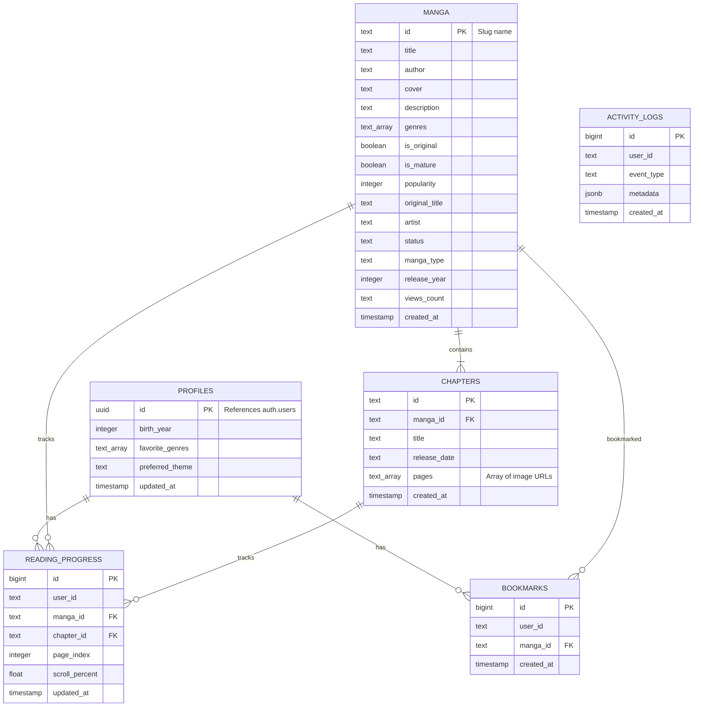

# 🗄️ Database Schema — Mangify

> **Database:** Supabase (PostgreSQL)
> **Schema File:** `supabase/schema.sql`
> **Migration Scripts:** `supabase/*.sql` + `scripts/run-migrations.js`

---

## 📊 ER Diagram

---

## 🔐 Row Level Security (RLS)

| ตาราง | SELECT | INSERT | UPDATE | DELETE |
| :--- | :--- | :--- | :--- | :--- |
| `manga` | ✅ Public | ❌ | ❌ | ❌ |
| `chapters` | ✅ Public | ❌ | ❌ | ❌ |
| `profiles` | ✅ Public | ❌ (trigger) | ✅ Owner only | ❌ |
| `bookmarks` | ✅ Owner only | ✅ Owner only | ❌ | ✅ Owner only |
| `reading_progress` | ✅ Owner only | ✅ Owner only | ✅ Owner only | ✅ Owner only |
| `activity_logs` | ✅ Owner only | ✅ Owner only | ❌ | ❌ |

---

## 📝 Migration Files

| ไฟล์ | คำอธิบาย |
| :--- | :--- |
| `supabase/schema.sql` | Schema หลัก — สร้างตาราง, index, RLS, trigger |
| `supabase/add_birth_date.sql` | เพิ่มคอลัมน์ `birth_date` ใน profiles |
| `supabase/add_mature_content_and_birth_year.sql` | เพิ่ม `is_mature` ใน manga, `birth_year` ใน profiles |
| `supabase/profiles_preferences_migration.sql` | เพิ่ม `favorite_genres`, `preferred_theme` |
| `supabase/profiles_2fa_migration.sql` | เพิ่มระบบ 2FA |

---

## 🔄 Auto-Trigger

เมื่อ User ใหม่ Sign Up → Trigger `handle_new_user()` จะสร้าง Row ใน `profiles` อัตโนมัติ พร้อมก๊อปปี้ค่า `birth_year` จาก `raw_user_meta_data`

---

## 🔗 Related Notes

- [[00 - Mangify Project Overview]]
- [[04 - Authentication & Age Gate]]
