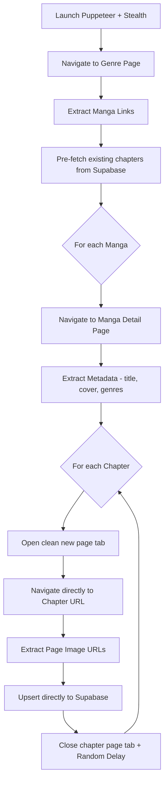

# 🕷️ Scraper & Data Pipeline — Mangify

> **เครื่องมือ:** Puppeteer + puppeteer-extra + StealthPlugin
> **เป้าหมาย:** ดึงข้อมูลมังงะจากเว็บแปลมังงะภาษาไทย
> **สคริปต์ทั้งหมด:** `scripts/` (38 ไฟล์)

---

## 📥 Data Sources

| แหล่งข้อมูล | สคริปต์ | สถานะ |
| :--- | :--- | :--- |
| `doujin-lc.net` (โดจินเกาหลี-hmanhwa) | `scrape-doujin-lc.js` / `scrape-chapters-direct.js` | ✅ เปิดใช้งานบน Ingestion Pipeline ร่วมกับระบบ RLS |
| อื่นๆ (General manga) | `scrape-up-manga.js` | ✅ ใช้งานได้ปกติ |
| Manual ingestion | `ingest.js` | ✅ ใช้งานได้ปกติ |

---

## ⏰ Scheduled Ingestion (GitHub Actions)

กระบวนการอัปเดตข้อมูลมังงะกำหนดไว้ในเวิร์กโฟลว์ของ GitHub Actions ที่ไฟล์ `.github/workflows/ingest.yml` โดยกำหนดตั้งเวลาทำแบบอัตโนมัติ **ทุกๆ 6 ชั่วโมง** (`0 */6 * * *`) หรือเรียกใช้งานด้วยตนเองผ่าน `workflow_dispatch` เวิร์กโฟลว์นี้รันสแครปเปอร์ 2 ชุดหลักดังนี้:

1. **สแครปเปอร์มังงะทั่วไป (`Run General Manga Scraper`):** รันคำสั่ง `node scripts/scrape-up-manga.js` เพื่อดึงข้อมูลมังงะใหม่ๆ จาก `up-manga.co`
2. **สแครปเปอร์มังงะสำหรับผู้ใหญ่ 18+ (`Run Mature Manga (18+) Scraper`):** รันคำสั่ง `node scripts/scrape-doujin-lc.js` เพื่อดึงข้อมูลโดจินและ H-Manhwa จาก `doujin-lc.net`

> [!NOTE]
> ทั้งสองขั้นตอนติดตั้งคุณสมบัติ `continue-on-error: true` เพื่อประกันว่า หากสแครปเปอร์ของแหล่งข้อมูลใดแหล่งหนึ่งหยุดชะงัก (เช่น จากการท้าทายของระบบความปลอดภัยเครือข่าย) จะไม่ส่งผลทำให้สแครปเปอร์อีกแหล่งหนึ่งหยุดทำงานไปด้วย

---

## 🔄 Scraper Architecture

### สิ่งที่เรียนรู้จาก Cloudflare Bypass:
1. **ห้าม** ผสม Heavy I/O (Supabase calls) ภายใน Puppeteer navigation lifecycle → ทำให้ถูก detect
2. **ต้อง** ทำ Pre-fetch → scrape → Bulk post-write (Decouple I/O)
3. **ต้อง** ใช้ `puppeteer-extra-plugin-stealth` เพื่อ spoof browser fingerprint
4. **ต้อง** ใช้ **Direct Navigation (goto)** ในหน้า/แท็บที่เปิดขึ้นมาใหม่แทนการทำ `click()` หรือ `goBack()` ในหน้าประวัติเก่าเพื่อลดโอกาสการโดนท้าทายจาก JS Challenge (Cloudflare Challenge)

---

## 🛠️ Data Repair Scripts

| สคริปต์ | วัตถุประสงค์ |
| :--- | :--- |
| `backfill-covers.js` | ซ่อม cover URL ที่เป็น null/base64 SVG placeholder |
| `backfill-metadata.js` | เติมข้อมูล metadata ที่ขาดหาย |
| `fix-title.js` | แก้ชื่อเรื่องที่โดน overwrite เป็น "Sorry, you have been blocked" |
| `clean-database-ids.js` | ล้าง ID format ที่ไม่ถูกต้อง |
| `clean-database-ids-v2.js` | v2 ปรับปรุง logic ล้าง ID |
| `clean-db-genres.js` | แปลหมวดหมู่ EN→TH + ลบ prefix "หมวดหมู่" ซ้ำซ้อน |
| `scrape-chapters-direct.js` | ดึงข้อมูลตอนของมังงะเป้าหมายที่เคยติดบล็อคโดยตรง |
| `update-kang-lim.js` | แก้ไขข้อมูลเฉพาะเรื่อง Kang Lim |
| `update-reality-quest.js` | แก้ไขข้อมูลเฉพาะเรื่อง Reality Quest |

---

## 📊 Data Cleansing Summary (2026-06-21)

- มังงะทั้งหมดในระบบ: **89 เรื่อง**
- ซ่อมหมวดหมู่: **10 เรื่อง** (EN→TH translation + dedup)
- ซ่อม Cover: **ทั้งหมดเรียบร้อย** (Moby Dick, You Won't Get Me Twice และเรื่องอื่นๆ ได้รับการ Backfill เรียบร้อยแล้ว)
- ซ่อมแซมหน้าตอนที่ขาดหาย: **Moby Dick (99 ตอน)** และ **You Won't Get Me Twice (26 ตอน)** ได้รับการดึงข้อมูลหน้าและบันทึกเรียบร้อย สามารถอ่านได้จริงแล้ว

---

## 🔗 Related Notes

- [[00 - Mangify Project Overview]]
- [[01 - Database Schema]]
- [[05 - Session Work Log]]
