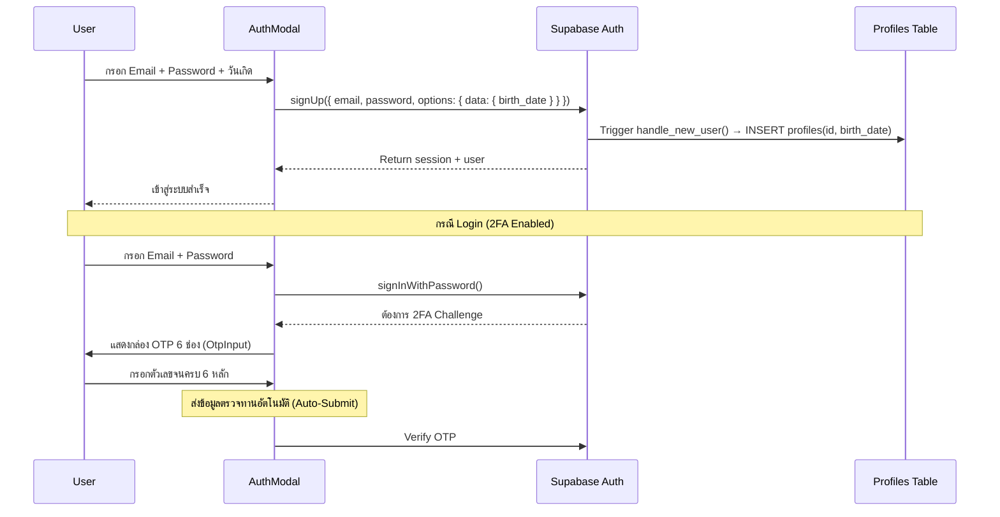

# 🔒 Authentication & Age Gate — Mangify

> **Auth Provider:** Supabase Auth (Email/Password + 2FA)
> **Age Gate:** ตรวจสอบ `birth_date` หรือ `birth_year` จาก `profiles` table
> **OTP Standard:** กล่องกรอกรหัสตัวเลข 6 หลัก (Digi Standard) พร้อมระบบส่งข้อมูลอัตโนมัติ (Auto-Submit)

---

## 🔑 Authentication Flow



---

## 🔞 Age Gate System

### สูตรการคำนวณอายุ (Precise Age Calculation)
ประเมินอายุโดยใช้ความต่างของปีเกิด และคำนวณความคลาดเคลื่อนระดับวัน/เดือน:
```javascript
let userAge = null;
if (profile.birth_date) {
  const today = new Date();
  const birthDate = new Date(profile.birth_date);
  if (!isNaN(birthDate.getTime())) {
    let age = today.getFullYear() - birthDate.getFullYear();
    const m = today.getMonth() - birthDate.getMonth();
    if (m < 0 || (m === 0 && today.getDate() < birthDate.getDate())) {
      age--;
    }
    userAge = age;
  }
} else if (profile.birth_year) {
  userAge = new Date().getFullYear() - profile.birth_year;
}
const isAdult = userAge !== null && userAge >= 18;
```

### สถานะการเข้าถึงเนื้อหา Mature (`is_mature = true`)

| สถานะผู้ใช้ | การแสดงผลในแคตตาล็อก | การเข้าถึงผ่าน API (`/api/chapters`) |
| :--- | :--- | :--- |
| **Guest** (ไม่ได้เข้าสู่ระบบ) | **ซ่อนโดยสิ้นเชิง** (Filtered out) | **403 Forbidden** 🔒 |
| **Logged-in (< 18 ปี)** | **ซ่อนโดยสิ้นเชิง** (Filtered out) | **403 Forbidden** 🔒 |
| **Logged-in (≥ 18 ปี)** | แสดงปกติ | **200 OK** (ดึงเนื้อหามาอ่านได้) |
| **Logged-in (Admin)** | แสดงปกติ | **200 OK** (ดึงเนื้อหามาอ่านได้เสมอ) |

---

## 🔢 6-Digit OTP UI/UX (Digi Standard)

ตัวกล่องรหัสยืนยันได้รับการพัฒนาขึ้นมาใหม่ในคอมโพเนนต์ `OtpInput.tsx` มีคุณสมบัติดังนี้:
1. **ตัวคีย์บอร์ดโมบาย:** ใช้ `inputMode="numeric"` และ `pattern="[0-9]*"` เพื่อบังคับให้สมาร์ทโฟนเปิดใช้คีย์บอร์ดปุ่มกดตัวเลขเท่านั้น
2. **การนำทางอัตโนมัติ:** โฟกัสขยับไปกล่องถัดไปเมื่อกรอกตัวเลข และเลื่อนถอยหลังไปเคลียร์ข้อมูลตัวเดิมเมื่อกดลบ (Backspace)
3. **การวางข้อมูล (Paste):** รองรับการก๊อปปี้ตัวเลข 6 ตัวแล้วสั่งวางระบบจะแยกไปใส่ให้ทีละช่องและโฟกัสไปกล่องสุดท้ายโดยอัตโนมัติ
4. **Auto-Submit:** ตรวจจับหากรอกตัวเลขครบทั้ง 6 หลักแล้วจะทริกเกอร์ส่งแบบฟอร์มตรวจสอบ OTP และอัปเดตสถานะทันทีโดยไม่ต้องคลิกปุ่มกดยืนยัน

---

## 👤 User Profile Data

ข้อมูลที่เก็บในตาราง `profiles`:

| Field | Type | วัตถุประสงค์ |
| :--- | :--- | :--- |
| `id` | UUID | PK → references `auth.users` |
| `birth_date` | DATE | วันเกิด ใช้คำนวณอายุแบบละเอียด |
| `birth_year` | INTEGER | ปีเกิด (Legacy - ใช้สำรองหาก birth_date เป็น null) |
| `two_factor_enabled` | BOOLEAN | ตรวจสอบว่าบัญชีมีการเปิดใช้ 2FA หรือไม่ |
| `favorite_genres` | TEXT[] | หมวดหมู่โปรดสำหรับ Recommendation |
| `preferred_theme` | TEXT | ธีมที่ต้องการ sync ข้ามเครื่อง |
| `updated_at` | TIMESTAMP | Last update timestamp |

---

## 🔗 Related Notes

- [[00 - Mangify Project Overview]]
- [[01 - Database Schema]]
- [[05 - Session Work Log]]
