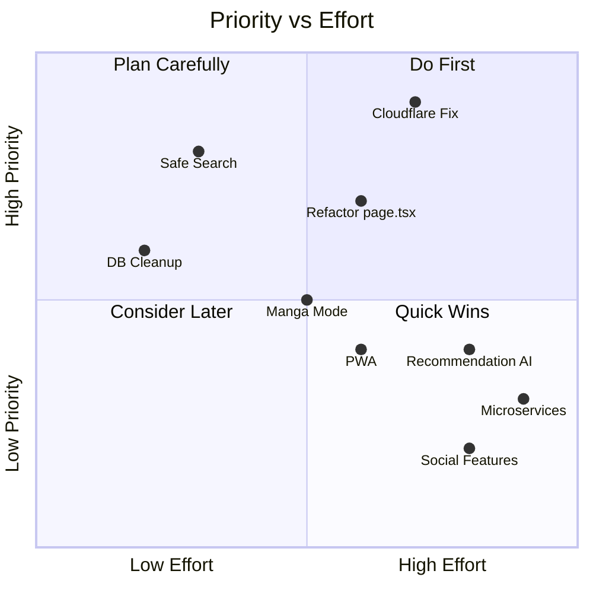

# 🚀 Future Roadmap — Mangify

> **อัปเดตล่าสุด:** 2026-06-21

---

## 📌 Phase ถัดไป (Near-term)

### 🔧 Infrastructure & Code Quality
- [ ] **Refactor `page.tsx`** — แยกออกเป็น feature modules (reader, catalog, auth)
- [ ] **Add input validation** — ใช้ Zod สำหรับ API routes
- [ ] **Standardize error responses** — consistent error format ทุก endpoint
- [ ] **Cleanup DB columns** — ตัดสินใจ `birth_year` vs `birth_date` → migrate + drop

### 📥 Data Pipeline
- [ ] **แก้ Cloudflare block** — ลอง FlareSolverr หรือ Playwright
- [ ] **Scraper retry mechanism** — retry failed chapters with exponential backoff
- [ ] **Scraper progress report** — สรุปผลว่า chapter ไหน success/fail
- [ ] **Scheduled scraping** — ตั้ง cron job ดึงตอนใหม่อัตโนมัติ

### 🎨 UX Improvements
- [ ] **Manga Mode (Horizontal)** — เพิ่มโหมดอ่านแบบพลิกหน้าซ้าย-ขวา (Phase 5 ใน Project Plan)
- [ ] **Safe Search Toggle** — ปุ่มซ่อน mature content ในหน้า catalog
- [ ] **Search Enhancement** — Full-text search + autocomplete
- [ ] **Offline Reading** — Service Worker + cached chapter pages

---

## 🌟 Phase อนาคต (Long-term)

### 🧠 Data Science & AI
- [ ] **Jaccard Similarity Recommendation** — แนะนำมังงะจาก `favorite_genres` match
- [ ] **Activity Correlation** — วิเคราะห์ว่า user อ่านตรงกับ genres ที่ประกาศหรือไม่
- [ ] **Age-Segmented Popularity** — จัดอันดับมังงะยอดนิยมแยกตามช่วงอายุ
- [ ] **Reading Habit Analysis** — ช่วงเวลาที่อ่าน vs ธีมที่ใช้

### 🏗️ Scale Architecture
- [ ] **Image CDN** — ย้าย manga pages ไปเก็บบน Cloudflare R2 + CDN
- [ ] **Redis Cache** — cache hot metadata + progress buffer
- [ ] **Microservices** — แยก Catalog, User, Upload services (ตาม backend_architecture.md)
- [ ] **Docker + CI/CD** — containerize + GitHub Actions deployment

### 📱 Platform
- [ ] **PWA Support** — installable web app + push notifications
- [ ] **Mobile Optimization** — swipe gestures, haptic feedback
- [ ] **Social Features** — comments, ratings, sharing

---

## 🎯 Priority Matrix

---

## 🔗 Related Notes

- [[00 - Mangify Project Overview]]
- [[06 - Open Issues & Blockers]]
